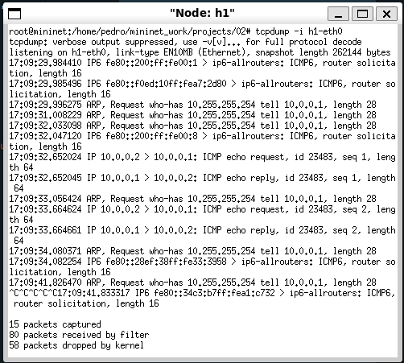
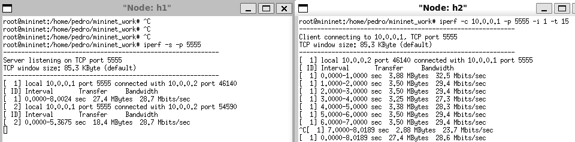
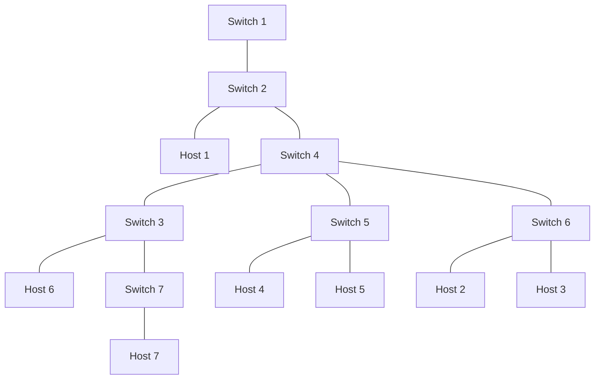

# Practical Work with Mininet
This practical work uses Mininet to create and test virtual networks in two topology configurations: a linear topology and a custom topology implemented in Python.

## Exercise 1: Linear Topology with Eight Hosts
Objective
Create a linear topology with eight hosts, run connectivity and performance tests, and capture the results.

### Steps to Execution
1. **Create the Linear Topology**:\
    **a**. Command to create the topology with 30 Mbps:bandwidth, default Mininet controller and standardized MAC addresses:
    ```bash
    sudo mn --topo=linear,8 --mac --link=tc,bw=30
    ```
2. **Inspect Interface Information, MAC Addresses, IP and Ports**:\
    **a**. Commands to view topology information:
    ```bash
    nodes      # Node list in the topology
    net        # Display network configuration
    h1 ifconfig  # Display interface information for h1
    ```
3. **Create Topology Diagram**:
    ```mermaid
    graph TD
      c0[Controlador c0] --> s1
      s1[Switch s1] --> h1[Host h1]
      s1 --> s2[Switch s2]
      s2 --> h2[Host h2]
      s2 --> s3[Switch s3]
      s3 --> h3[Host h3]
      s3 --> s4[Switch s4]
      s4 --> h4[Host h4]
      s4 --> s5[Switch s5]
      s5 --> h5[Host h5]
      s5 --> s6[Switch s6]
      s6 --> h6[Host h6]
      s6 --> s7[Switch s7]
      s7 --> h7[Host h7]
      s7 --> s8[Switch s8]
      s8 --> h8[Host h8]
    ```
4. **Perform Ping Tests**:\
    **a**. Test connectivity between nodes with the command:
      ```bash
      pingall # Pings between all nodes
      ```
    **b**. Use tcpdump to view packets pinged by h2 to h1:
    ```bash
    xterm h1
    tcpdump -i h1-eth0
    ```
    
5. **TCP Testing with iPerf**:\
    **a**. On h1, configure the TCP server on port 5555:
    ```bash
    xterm h1
    iperf -s -p 5555
    ```
    **b**. On h2, run the client to test bandwidth, reporting per second for 15 seconds:
    ```bash
    xterm h2
    iperf -c 10.0.0.1 -p 5555 -i 1 -t 15
    ```
    
    **c**. To test bandwidths of 1, 5, 10, 15, 20, and 25 Mbps, recreate the topology with each value using:
    ```bash
    sudo mn -c
    sudo mn --top=linear,8 --mac --link=tc,bw=<value>
    ```
    // TODO (Pedro): Add the results of the tests using topic `a` and `b` as reference.

## Exercise 2: Custom Topology in Python
Implement a custom topology in Python, inspect the interfaces, create a diagram, configure MAC rules and verify connectivity.

a) **Topology Implementation**:\
Topology implementation in Python:
```shell
sudo python3 topology.py
```

b) **Inspect Interface Information, MAC Addresses, IP and Ports**:\
Commands to view topology information:
```shell
mininet> nodes
available nodes are:
c0 h1 h2 h3 h4 h5 h6 h7 s1 s2 s3 s4 s5 s6 s7
mininet> net
h1 h1-eth0:s2-eth2
h2 h2-eth0:s6-eth2
h3 h3-eth0:s6-eth3
h4 h4-eth0:s5-eth2
h5 h5-eth0:s4-eth3
h6 h6-eth0:s3-eth1
h7 h7-eth0:s7-eth2
s1 lo:  s1-eth1:s2-eth1
s2 lo:  s2-eth1:s1-eth1 s2-eth2:h1-eth0 s2-eth3:s4-eth1
s3 lo:  s3-eth1:h6-eth0 s3-eth2:s7-eth1 s3-eth3:s4-eth2
s4 lo:  s4-eth1:s2-eth3 s4-eth2:s3-eth3 s4-eth3:h5-eth0 s4-eth4:s5-eth1
s5 lo:  s5-eth1:s4-eth4 s5-eth2:h4-eth0 s5-eth3:s6-eth1
s6 lo:  s6-eth1:s5-eth3 s6-eth2:h2-eth0 s6-eth3:h3-eth0
s7 lo:  s7-eth1:s3-eth2 s7-eth2:h7-eth0
c0
mininet> dump
<Host h1: h1-eth0:10.0.0.1 pid=64469>
<Host h2: h2-eth0:10.0.0.2 pid=64471>
<Host h3: h3-eth0:10.0.0.3 pid=64473>
<Host h4: h4-eth0:10.0.0.4 pid=64475>
<Host h5: h5-eth0:10.0.0.5 pid=64477>
<Host h6: h6-eth0:10.0.0.6 pid=64479>
<Host h7: h7-eth0:10.0.0.7 pid=64481>
<OVSSwitch s1: lo:127.0.0.1,s1-eth1:None pid=64486>
<OVSSwitch s2: lo:127.0.0.1,s2-eth1:None,s2-eth2:None,s2-eth3:None pid=64489>
<OVSSwitch s3: lo:127.0.0.1,s3-eth1:None,s3-eth2:None,s3-eth3:None pid=64492>
<OVSSwitch s4: lo:127.0.0.1,s4-eth1:None,s4-eth2:None,s4-eth3:None,s4-eth4:None pid=64495>
<OVSSwitch s5: lo:127.0.0.1,s5-eth1:None,s5-eth2:None,s5-eth3:None pid=64498>
<OVSSwitch s6: lo:127.0.0.1,s6-eth1:None,s6-eth2:None,s6-eth3:None pid=64501>
<OVSSwitch s7: lo:127.0.0.1,s7-eth1:None,s7-eth2:None pid=64504>
<OVSController c0: 127.0.0.1:6653 pid=64462>
```

c) **Create Topology Diagram**:


d) **Ping Tests**:
```shell
mininet> pingall
*** Ping: testing ping reachability
h1 -> h2 h3 h4 h5 h6 h7
h2 -> h1 h3 h4 h5 h6 h7
h3 -> h1 h2 h4 h5 h6 h7
h4 -> h1 h2 h3 h5 h6 h7
h5 -> h1 h2 h3 h4 h6 h7
h6 -> h1 h2 h3 h4 h5 h7
h7 -> h1 h2 h3 h4 h5 h6
*** Results: 0% dropped (42/42 received)
```

e) **MAC Rules Configuration between h2, h3 and h4**:
1. See the MAC of the hosts:
    ```shell
    mininet> h4 ifconfig
    h4-eth0: flags=4163<UP,BROADCAST,RUNNING,MULTICAST>  mtu 1500
            inet 10.0.0.4  netmask 255.0.0.0  broadcast 10.255.255.255
            inet6 fe80::200:ff:fe00:4  prefixlen 64  scopeid 0x20<link>
            ether 00:00:00:00:00:04  txqueuelen 1000  (Ethernet)
    mininet>
    mininet> h2 ifconfig
    h2-eth0: flags=4163<UP,BROADCAST,RUNNING,MULTICAST>  mtu 1500
        inet 10.0.0.2  netmask 255.0.0.0  broadcast 10.255.255.255
        inet6 fe80::200:ff:fe00:2  prefixlen 64  scopeid 0x20<link>
        ether 00:00:00:00:00:02  txqueuelen 1000  (Ethernet)
    mininet>
    mininet> h3 ifconfig
    h3-eth0: flags=4163<UP,BROADCAST,RUNNING,MULTICAST>  mtu 1500
            inet 10.0.0.3  netmask 255.0.0.0  broadcast 10.255.255.255
            inet6 fe80::200:ff:fe00:3  prefixlen 64  scopeid 0x20<link>
            ether 00:00:00:00:00:03  txqueuelen 1000  (Ethernet)
    ```
2. Delete all existing switch rules of `s5` and `s6`:
    a) See the existing rules:
    ```shell
    mininet> sh ovs-ofctl dump-flows s5
    mininet> sh ovs-ofctl dump-flows s6
    ```
    b) Delete the rules:
    ```shell
    mininet> sh ovs-ofctl del-flows s5
    mininet> sh ovs-ofctl del-flows s6
    ```
    c) Check if the rules were deleted:
    ```shell
    mininet> sh ovs-ofctl dump-flows s5
    mininet> sh ovs-ofctl dump-flows s6
    ```
3. Add a rule to switch s5 and s6 to sent between h2, h3 and h4:
	```shell
    # h2 to h3
    # s6
    mininet> sh sudo ovs-ofctl add-flow s6 dl_src=00:00:00:00:00:03,dl_dst=00:00:00:00:00:02,actions=output:2
    mininet> sh sudo ovs-ofctl add-flow s6 dl_src=00:00:00:00:00:02,dl_dst=00:00:00:00:00:03,actions=output:3
    mininet> sh sudo ovs-ofctl add-flow s6 dl_type=0x806,nw_proto=1,action=flood

    # h2 to h4
    # s6
    mininet> sh sudo ovs-ofctl add-flow s6 dl_src=00:00:00:00:00:02,dl_dst=00:00:00:00:00:04,actions=output:1
    mininet> sh sudo ovs-ofctl add-flow s6 dl_src=00:00:00:00:00:04,dl_dst=00:00:00:00:00:02,actions=output:2
    # s5
    mininet> sh sudo ovs-ofctl add-flow s5 dl_src=00:00:00:00:00:04,dl_dst=00:00:00:00:00:02,actions=output:3
    mininet> sh sudo ovs-ofctl add-flow s5 dl_src=00:00:00:00:00:02,dl_dst=00:00:00:00:00:04,actions=output:2
    mininet> sh sudo ovs-ofctl add-flow s5 dl_type=0x806,nw_proto=1,action=flood


    # h3 to h2
    # s6
    mininet> sh sudo ovs-ofctl add-flow s6 dl_src=00:00:00:00:00:03,dl_dst=00:00:00:00:00:04,actions=output:1
    mininet> sh sudo ovs-ofctl add-flow s6 dl_src=00:00:00:00:00:04,dl_dst=00:00:00:00:00:03,actions=output:3
    # s5
    mininet> sh sudo ovs-ofctl add-flow s5 dl_src=00:00:00:00:00:03,dl_dst=00:00:00:00:00:04,actions=output:2
    mininet> sh sudo ovs-ofctl add-flow s5 dl_src=00:00:00:00:00:04,dl_dst=00:00:00:00:00:03,actions=output:3
    ```

f) **Ping Tests between h2, h3 and h4**:
```shell
mininet> h2 ping -c 2 h3
PING 10.0.0.3 (10.0.0.3) 56(84) bytes of data.
64 bytes from 10.0.0.3: icmp_seq=1 ttl=64 time=0.049 ms

--- 10.0.0.3 ping statistics ---
1 packets transmitted, 1 received, 0% packet loss, time 0ms
rtt min/avg/max/mdev = 0.049/0.049/0.049/0.000 ms
PING 10.0.0.3 (10.0.0.3) 56(84) bytes of data.
mininet> h2 ping -c 2 h4
64 bytes from 10.0.0.3: icmp_seq=1 ttl=64 time=0.047 ms
64 bytes from 10.0.0.3: icmp_seq=2 ttl=64 time=0.035 ms

--- 10.0.0.3 ping statistics ---
2 packets transmitted, 2 received, 0% packet loss, time 999ms
rtt min/avg/max/mdev = 0.035/0.041/0.047/0.006 ms
mininet> h3 ping -c 2 h2
PING 10.0.0.2 (10.0.0.2) 56(84) bytes of data.
64 bytes from 10.0.0.2: icmp_seq=1 ttl=64 time=0.371 ms
64 bytes from 10.0.0.2: icmp_seq=2 ttl=64 time=0.034 ms

--- 10.0.0.2 ping statistics ---
2 packets transmitted, 2 received, 0% packet loss, time 999ms
rtt min/avg/max/mdev = 0.034/0.202/0.371/0.168 ms
mininet> h3 ping -c 2 h4
PING 10.0.0.4 (10.0.0.4) 56(84) bytes of data.
64 bytes from 10.0.0.4: icmp_seq=1 ttl=64 time=0.452 ms
64 bytes from 10.0.0.4: icmp_seq=2 ttl=64 time=0.032 ms

--- 10.0.0.4 ping statistics ---
2 packets transmitted, 2 received, 0% packet loss, time 999ms
rtt min/avg/max/mdev = 0.032/0.242/0.452/0.210 ms
mininet> h4 ping -c 2 h3
PING 10.0.0.3 (10.0.0.3) 56(84) bytes of data.
64 bytes from 10.0.0.3: icmp_seq=1 ttl=64 time=0.038 ms
64 bytes from 10.0.0.3: icmp_seq=2 ttl=64 time=0.032 ms

--- 10.0.0.3 ping statistics ---
2 packets transmitted, 2 received, 0% packet loss, time 1000ms
rtt min/avg/max/mdev = 0.032/0.035/0.038/0.003 ms
mininet> h4 ping -c 2 h2
PING 10.0.0.2 (10.0.0.2) 56(84) bytes of data.
64 bytes from 10.0.0.2: icmp_seq=1 ttl=64 time=0.407 ms
64 bytes from 10.0.0.2: icmp_seq=2 ttl=64 time=0.034 ms

--- 10.0.0.2 ping statistics ---
2 packets transmitted, 2 received, 0% packet loss, time 999ms
rtt min/avg/max/mdev = 0.034/0.220/0.407/0.186 ms
```

## Team
- Pedro Luis
- Arthur Bueno
